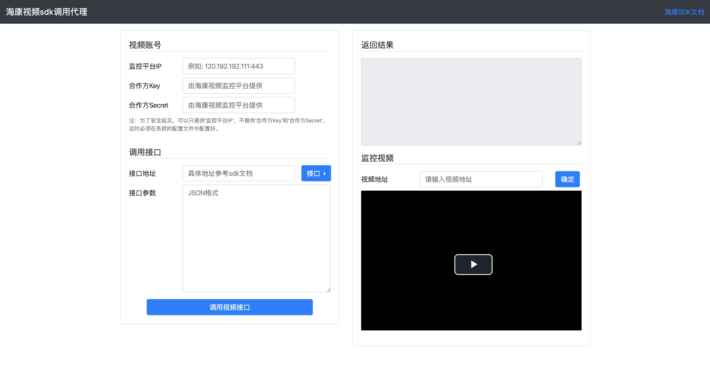

# 海康视频接口调用代理

该项目为调用海康视频接口的代理，方便前端调用视频相关接口。

海康的视频接入文档地址为：[HikVision](https://open.hikvision.com/docs/37e38899e583cfe4f9879a07a5294bf4)

该项目代码库：[github](https://github.com/jmaxhu/hik-proxy) [码云](https://gitee.com/maxwell/hik-proxy)

## 系统截图



## 系统运行

### 本地运行

```shell script
./mvnw spring-boot:run
```

### docker 运行

```shell script
docker run -p "8090:8090" \
      -e HIK_KEYS[0]_IP=xxx \
      -e HIK_KEYS[0]_APPKEY=change \
      -e HIK_KEYS[0]_APPSECRET=change \
      jmaxhu/hik-proxy:latest
```

### 使用 docker compose

创建一个 docker-compose.yml 的文件，内容如下。

```
version: '3'

services:
  hik-proxy:
    image: jmaxhu/hik-proxy
    container_name: hik-proxy
    restart: always
    ports:
      - "8090:8090"
    environment:
      - HIK_KEYS[0]_IP=change it
      - HIK_KEYS[0]_APPKEY=change it
      - HIK_KEYS[0]_APPSECRET=change it
```

然后切换到包含该文件的目录，运行命令：

```
docker-compose up -d
```

### 生成 docker 镜像

创建本地镜像

```shell script
./mvnw compile jib:dockerBuild
```

生成镜像并上传到 docker hub

```shell script
./mvnw compile jib:build
```

## 使用说明

该项目只有一个接口地址为： **/api/hik**
只接收：**POST** 请求

请求的参数为：

 - ip, 视频监控平台的ip地址
 - apiUrl, 实际要调用的海康视频的api地址。
 - apiParams, 海康视频api接收的参数，以JSON格式序列化为字符串。
 
 返回结果为调用视频api地址的原始结果。
 
 ## 示例
 
 发送请求(请用真实ip代替):
 
 ```shell script
curl --location --request POST 'http://localhost:8090/api/hik' \
--header 'Content-Type: application/json' \
--data-raw '{
	"ip": "111.222.111.111",
	"apiUrl": "/api/resource/v1/camera/advance/cameraList",
	"apiParams": "{\"pageNo\":1,\"pageSize\":5}"
}'
```

返回结果：
```
HTTP/1.1 200 
Location: /api/hik
Content-Type: application/json
Content-Length: 4957
Date: Thu, 19 Mar 2020 14:26:50 GMT
Connection: close

{"code":"0","msg":"SUCCESS","data":{"total":6,"pageNo":1,"pageSize":5,"list":[{"altitude":null,"cameraIndexCode":"69c41a798a094b11a022b6ae5b22ddaf","cameraName":"第三通道","cameraType":0,"cameraTypeName":"枪"...
```

